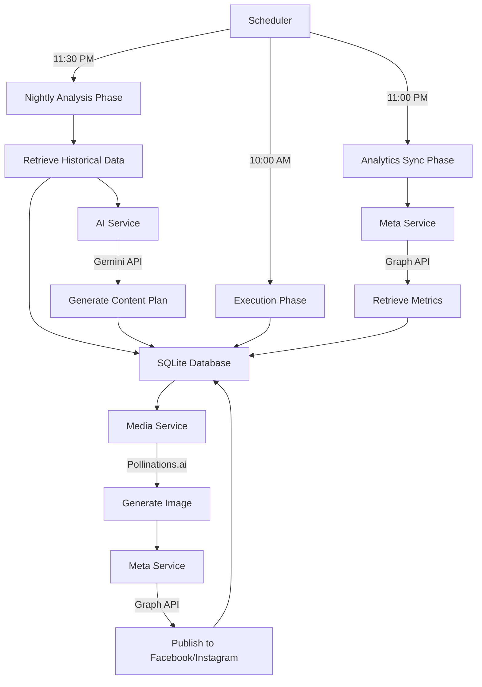

# Design Document: AI Social Media Manager

## Overview

The AI Social Media Manager is an autonomous Node.js application that operates on a daily schedule to analyze social media performance, plan content strategy using AI, generate media assets, and publish content to Facebook and Instagram. The system follows a three-phase daily workflow:

1. **Nightly Analysis Phase (11:30 PM)**: Retrieves historical post data from the last 7 days, sends it to Google Gemini AI for analysis, generates a content plan for the next day, and persists the plan to the database.

2. **Execution Phase (10:00 AM)**: Retrieves the planned content, generates media assets via Pollinations.ai, and publishes to Facebook and/or Instagram via the Meta Graph API.

3. **Analytics Sync Phase (11:00 PM)**: Retrieves performance metrics (likes, reach) from published posts and updates the database to inform future AI planning.

The architecture emphasizes modularity, with clear separation between database operations, AI services, social media publishing, media generation, and workflow orchestration. All operations include comprehensive error handling and logging to ensure system reliability and observability.

## Architecture

### System Components

The application follows a modular service-oriented architecture with the following components:

```
ai-social-media-manager/
├── index.js                    # Application entry point and initialization
├── db.js                       # Database operations and schema management
├── services/
│   ├── aiService.js           # Google Gemini API integration
│   ├── metaService.js         # Meta Graph API (Facebook/Instagram)
│   └── mediaService.js        # Pollinations.ai media generation
├── jobs/
│   └── dailyManager.js        # Daily workflow orchestration
├── .env                        # Environment configuration (gitignored)
├── .env.example               # Sample environment configuration
└── package.json               # Dependencies and scripts
```

### Technology Stack

- **Runtime**: Node.js (v18+)
- **Database**: SQLite3 (via `sqlite3` npm package)
- **AI Service**: Google Gemini 1.5 Flash (via `@google/generative-ai` SDK)
- **Social Media API**: Meta Graph API (via HTTP requests with `axios`)
- **Media Generation**: Pollinations.ai HTTP API
- **Scheduling**: node-cron
- **Configuration**: dotenv

### Data Flow



## Components and Interfaces

### Database Module (db.js)

**Responsibilities**:
- Initialize SQLite database and schema on startup
- Provide CRUD operations for post history
- Query historical data for AI analysis
- Update post status and metrics

**Key Functions**:

```javascript
// Initialize database and create schema
async function initializeDatabase()

// Retrieve posts from last N days with status 'published'
async function getHistoricalPosts(days = 7)

// Insert new content plan
async function insertContentPlan(plan)

// Update post status after publishing
async function updatePostStatus(id, status, errorDetails = null)

// Update post metrics from analytics
async function updatePostMetrics(id, likes, reach)

// Get today's planned post
async function getTodaysPlannedPost()
```

**Database Schema**:

```sql
CREATE TABLE IF NOT EXISTS post_history (
    id INTEGER PRIMARY KEY AUTOINCREMENT,
    target_date TEXT NOT NULL,
    platform TEXT NOT NULL,
    format TEXT NOT NULL,
    topic TEXT,
    caption TEXT,
    media_url TEXT,
    likes INTEGER DEFAULT 0,
    reach INTEGER DEFAULT 0,
    ai_analysis TEXT,
    status TEXT NOT NULL
);
```

### AI Service (services/aiService.js)

**Responsibilities**:
- Communicate with Google Gemini API
- Format historical data for AI analysis
- Parse and validate AI-generated content plans
- Implement retry logic for API failures

**Key Functions**:

```javascript
// Generate content plan based on historical performance
async function generateContentPlan(historicalPosts)

// Validate content plan structure and format
function validateContentPlan(plan)
```

**API Integration**:
- Uses `@google/generative-ai` SDK
- Model: `gemini-1.5-flash`
- Requires `GEMINI_API_KEY` environment variable
- Returns JSON with: `{ format, topic, caption, media_prompt, ai_analysis }`

### Meta Service (services/metaService.js)

**Responsibilities**:
- Publish posts to Facebook pages
- Publish posts, reels, and stories to Instagram
- Retrieve performance metrics from published posts
- Handle platform-specific API endpoints and requirements

**Key Functions**:

```javascript
// Publish to Facebook page
async function publishToFacebook(caption, mediaUrl)

// Publish to Instagram (handles posts, reels, stories)
async function publishToInstagram(format, caption, mediaUrl)

// Retrieve metrics for a published post
async function getPostMetrics(postId, platform)

// Sync metrics for recently published posts
async function syncRecentMetrics()
```

**API Integration**:
- Uses Meta Graph API v18.0+
- Requires `FB_PAGE_ACCESS_TOKEN`, `FB_PAGE_ID`, `IG_BUSINESS_ID`
- Endpoints:
  - Facebook: `/{page-id}/photos` or `/{page-id}/feed`
  - Instagram Posts: `/{ig-user-id}/media`
  - Instagram Stories: `/{ig-user-id}/media` with `media_type=STORIES`
  - Insights: `/{media-id}/insights`

### Media Service (services/mediaService.js)

**Responsibilities**:
- Generate images via Pollinations.ai API
- Construct appropriate URLs based on media prompts
- Handle format-specific media requirements

**Key Functions**:

```javascript
// Generate media URL based on format and prompt
async function generateMedia(format, prompt)
```

**API Integration**:
- Pollinations.ai endpoint: `https://image.pollinations.ai/prompt/{encoded_prompt}`
- Returns direct image URLs for posts and stories
- Returns placeholder or skips for reels (video not supported)

### Daily Manager (jobs/dailyManager.js)

**Responsibilities**:
- Orchestrate the three daily workflow phases
- Coordinate between database, AI, media, and publishing services
- Handle phase-specific error recovery
- Log phase execution status

**Key Functions**:

```javascript
// Execute nightly analysis and planning
async function nightlyAnalysisPhase()

// Execute morning content publishing
async function executionPhase()

// Execute evening analytics synchronization
async function analyticsSyncPhase()
```

**Workflow Logic**:

1. **Nightly Analysis Phase**:
   - Retrieve last 7 days of published posts
   - Send to AI service for analysis
   - Generate content plan for tomorrow
   - Persist plan to database

2. **Execution Phase**:
   - Retrieve today's planned post
   - Generate media if needed
   - Publish to appropriate platforms
   - Update status to 'published' or 'failed'

3. **Analytics Sync Phase**:
   - Query recently published posts (last 2 days)
   - Retrieve metrics from Meta API
   - Update database with likes and reach

### Application Entry Point (index.js)

**Responsibilities**:
- Load environment configuration
- Initialize database
- Register cron jobs for daily phases
- Provide graceful shutdown handling

**Initialization Sequence**:

```javascript
1. Load dotenv configuration
2. Validate critical environment variables
3. Initialize database schema
4. Register cron jobs:
   - '30 23 * * *' → nightlyAnalysisPhase
   - '0 10 * * *' → executionPhase
   - '0 23 * * *' → analyticsSyncPhase
5. Log startup completion
6. Keep process alive
```

## Data Models

### Post History Record

```typescript
interface PostHistory {
    id: number;                    // Auto-increment primary key
    target_date: string;           // ISO date string (YYYY-MM-DD)
    platform: 'facebook' | 'instagram' | 'both';
    format: 'post' | 'reel' | 'story';
    topic: string;                 // Content topic/theme
    caption: string;               // Post caption text
    media_url: string | null;      // Generated media URL
    likes: number;                 // Default 0
    reach: number;                 // Default 0
    ai_analysis: string;           // AI reasoning for content plan
    status: 'planned' | 'published' | 'failed';
}
```

### Content Plan (AI Output)

```typescript
interface ContentPlan {
    format: 'post' | 'reel' | 'story';
    topic: string;
    caption: string;
    media_prompt: string;          // Prompt for image generation
    ai_analysis: string;           // AI reasoning and strategy
}
```

### Environment Configuration

```typescript
interface EnvironmentConfig {
    GEMINI_API_KEY: string;        // Required for AI service
    FB_PAGE_ACCESS_TOKEN?: string; // Optional, warns if missing
    FB_PAGE_ID?: string;           // Optional, warns if missing
    IG_BUSINESS_ID?: string;       // Optional, warns if missing
}
```


## Correctness Properties

*A property is a characteristic or behavior that should hold true across all valid executions of a system—essentially, a formal statement about what the system should do. Properties serve as the bridge between human-readable specifications and machine-verifiable correctness guarantees.*

### Property 1: Default Metrics Initialization

*For any* new post record inserted without explicit likes and reach values, those fields should default to 0.

**Validates: Requirements 1.3**

### Property 2: Historical Query Filtering

*For any* database state with various posts at different dates and statuses, querying historical posts should return only those with status 'published' from the last 7 days.

**Validates: Requirements 2.1**

### Property 3: Complete Column Retrieval

*For any* post retrieved from the database, all columns (id, target_date, platform, format, topic, caption, media_url, likes, reach, ai_analysis, status) should be present in the result.

**Validates: Requirements 2.2**

### Property 4: Content Plan Structure Validation

*For any* content plan generated by the AI service, it must contain all required fields (format, topic, caption, media_prompt, ai_analysis) with valid values.

**Validates: Requirements 3.2, 3.3**

### Property 5: Format Enumeration Validation

*For any* content plan, the format field must be one of the valid enumerated values: 'post', 'reel', or 'story'.

**Validates: Requirements 3.4**

### Property 6: Content Plan Persistence

*For any* valid content plan, inserting it into the database should increase the record count by 1 and the new record should have status 'planned'.

**Validates: Requirements 4.1, 4.3**

### Property 7: Target Date Calculation

*For any* content plan inserted during the nightly analysis phase, the target_date should be exactly one day after the current date.

**Validates: Requirements 4.2**

### Property 8: Platform Derivation from Format

*For any* content plan, the platform should be correctly derived from the format: 'both' for 'post' and 'story' formats, 'instagram' for 'reel' format.

**Validates: Requirements 4.4**

### Property 9: Media URL Generation for Visual Formats

*For any* post with format 'post' or 'story' and a media prompt, the media service should generate a valid Pollinations.ai URL containing the encoded prompt.

**Validates: Requirements 5.1, 5.2**

### Property 10: Media URL Persistence

*For any* generated media URL, it should be stored in the corresponding post record's media_url field in the database.

**Validates: Requirements 5.3**

### Property 11: Platform-Based Publishing Routing

*For any* post with platform 'facebook' or 'both', the Facebook publishing service should be invoked; for any post with platform 'instagram' or 'both', the Instagram publishing service should be invoked.

**Validates: Requirements 6.1, 7.1**

### Property 12: API Payload Completeness

*For any* publish request to Facebook or Instagram, the API payload should include both the caption and media_url from the post record.

**Validates: Requirements 6.3**

### Property 13: Format-Specific Instagram Endpoints

*For any* Instagram publish operation, the correct endpoint should be used based on the format type (standard media endpoint for posts, stories endpoint for stories, reels endpoint for reels).

**Validates: Requirements 7.3**

### Property 14: Status Update Reflects Publish Outcome

*For any* publish operation, the post status in the database should be updated to 'published' if successful, or 'failed' if an error occurred.

**Validates: Requirements 8.1, 8.2**

### Property 15: Metrics Synchronization Round Trip

*For any* recently published post, retrieving metrics from the Meta Graph API and updating the database should result in the likes and reach columns containing the retrieved values.

**Validates: Requirements 9.2, 9.3**

### Property 16: Error Logging Completeness

*For any* error that occurs during system operation, the log output should contain both the error message and stack trace.

**Validates: Requirements 12.2**

### Property 17: Operation Lifecycle Logging

*For any* major operation (phase execution, publish, sync), the logs should contain both a start message and a completion message with status indicator.

**Validates: Requirements 10.5, 12.3, 12.4**

### Property 18: Non-Critical Error Resilience

*For any* non-critical error (missing optional configuration, API timeout, single publish failure), the system process should continue running without termination.

**Validates: Requirements 12.5**

### Property 19: Configuration Usage Consistency

*For any* API call to Gemini or Meta services, the corresponding environment variables (GEMINI_API_KEY, FB_PAGE_ACCESS_TOKEN, FB_PAGE_ID, IG_BUSINESS_ID) should be used for authentication and identification.

**Validates: Requirements 11.2, 11.3, 6.2, 7.2**


## Error Handling

The system implements comprehensive error handling across all components to ensure reliability and observability:

### Error Categories

**Critical Errors** (prevent system startup):
- Missing GEMINI_API_KEY environment variable
- Database initialization failure
- Invalid database schema

**Non-Critical Errors** (logged with warnings, system continues):
- Missing Meta API credentials (FB_PAGE_ACCESS_TOKEN, FB_PAGE_ID, IG_BUSINESS_ID)
- Single publish operation failure
- Analytics sync API timeout
- Invalid AI response (triggers retry)

### Error Handling Patterns

**Database Operations**:
```javascript
try {
    await db.insertContentPlan(plan);
    console.log('✓ Content plan saved');
} catch (error) {
    console.error('✗ Failed to save content plan:', error.message);
    console.error(error.stack);
    // Continue operation, retry on next cycle
}
```

**API Calls with Retry**:
```javascript
async function generateContentPlan(historicalPosts, retryCount = 0) {
    try {
        const response = await gemini.generateContent(prompt);
        const plan = JSON.parse(response.text());
        return validateContentPlan(plan);
    } catch (error) {
        console.error('✗ AI service error:', error.message);
        if (retryCount < 1) {
            console.log('↻ Retrying...');
            return generateContentPlan(historicalPosts, retryCount + 1);
        }
        throw error;
    }
}
```

**Graceful Degradation**:
```javascript
async function publishToFacebook(caption, mediaUrl) {
    if (!process.env.FB_PAGE_ACCESS_TOKEN) {
        console.warn('⚠ FB_PAGE_ACCESS_TOKEN not configured, simulating publish');
        return { id: 'simulated_' + Date.now() };
    }
    // Actual publish logic
}
```

### Logging Strategy

**Log Levels**:
- `console.log('✓ ...')` - Successful operations
- `console.log('→ ...')` - Operation start
- `console.warn('⚠ ...')` - Non-critical issues
- `console.error('✗ ...')` - Errors with details

**Logged Information**:
- Phase execution start/completion
- Database operation results
- API call outcomes
- Generated content details
- Metrics updates
- Error messages with stack traces
- Configuration warnings

## Testing Strategy

The testing strategy employs a dual approach combining unit tests for specific scenarios and property-based tests for comprehensive validation.

### Unit Testing

**Focus Areas**:
- Database schema initialization and structure
- Specific edge cases (empty database, missing configuration)
- Cron job registration and schedule validation
- File existence (.env.example)
- Error handling paths (invalid JSON, API failures)

**Example Unit Tests**:

```javascript
// Database initialization
test('should create post_history table with correct schema', async () => {
    await initializeDatabase();
    const schema = await db.getTableInfo('post_history');
    expect(schema).toContainColumn('id', 'INTEGER');
    expect(schema).toContainColumn('likes', 'INTEGER', 0);
    expect(schema).toContainColumn('reach', 'INTEGER', 0);
});

// Cron schedule validation
test('should register nightly analysis at 11:30 PM', () => {
    const jobs = cron.getTasks();
    expect(jobs).toContainSchedule('30 23 * * *');
});

// Edge case: empty database
test('should return empty array when no historical posts exist', async () => {
    const posts = await getHistoricalPosts(7);
    expect(posts).toEqual([]);
});

// Edge case: missing configuration
test('should log warning and simulate publish when FB token missing', async () => {
    delete process.env.FB_PAGE_ACCESS_TOKEN;
    const result = await publishToFacebook('test', 'url');
    expect(console.warn).toHaveBeenCalledWith(expect.stringContaining('not configured'));
    expect(result.id).toMatch(/^simulated_/);
});
```

### Property-Based Testing

**Configuration**:
- Library: `fast-check` (JavaScript property-based testing)
- Minimum iterations: 100 per property test
- Each test references its design document property

**Property Test Examples**:

```javascript
// Property 1: Default Metrics Initialization
test('Feature: ai-social-media-manager, Property 1: Default metrics initialization', () => {
    fc.assert(
        fc.asyncProperty(
            fc.record({
                target_date: fc.date(),
                platform: fc.constantFrom('facebook', 'instagram', 'both'),
                format: fc.constantFrom('post', 'reel', 'story'),
                topic: fc.string(),
                caption: fc.string()
            }),
            async (postData) => {
                const id = await db.insertContentPlan(postData);
                const record = await db.getPostById(id);
                expect(record.likes).toBe(0);
                expect(record.reach).toBe(0);
            }
        ),
        { numRuns: 100 }
    );
});

// Property 2: Historical Query Filtering
test('Feature: ai-social-media-manager, Property 2: Historical query filtering', () => {
    fc.assert(
        fc.asyncProperty(
            fc.array(fc.record({
                target_date: fc.date({ min: new Date('2020-01-01'), max: new Date() }),
                status: fc.constantFrom('planned', 'published', 'failed'),
                platform: fc.constantFrom('facebook', 'instagram', 'both'),
                format: fc.constantFrom('post', 'reel', 'story')
            })),
            async (posts) => {
                // Insert all posts
                for (const post of posts) {
                    await db.insertPost(post);
                }
                
                // Query historical posts
                const results = await db.getHistoricalPosts(7);
                
                // Verify all results are published and within 7 days
                const sevenDaysAgo = new Date();
                sevenDaysAgo.setDate(sevenDaysAgo.getDate() - 7);
                
                for (const result of results) {
                    expect(result.status).toBe('published');
                    expect(new Date(result.target_date)).toBeGreaterThanOrEqual(sevenDaysAgo);
                }
            }
        ),
        { numRuns: 100 }
    );
});

// Property 8: Platform Derivation from Format
test('Feature: ai-social-media-manager, Property 8: Platform derivation from format', () => {
    fc.assert(
        fc.property(
            fc.constantFrom('post', 'reel', 'story'),
            (format) => {
                const platform = derivePlatformFromFormat(format);
                if (format === 'reel') {
                    expect(platform).toBe('instagram');
                } else {
                    expect(platform).toBe('both');
                }
            }
        ),
        { numRuns: 100 }
    );
});

// Property 14: Status Update Reflects Publish Outcome
test('Feature: ai-social-media-manager, Property 14: Status update reflects publish outcome', () => {
    fc.assert(
        fc.asyncProperty(
            fc.record({
                id: fc.integer({ min: 1 }),
                shouldSucceed: fc.boolean()
            }),
            async ({ id, shouldSucceed }) => {
                if (shouldSucceed) {
                    await updatePostStatus(id, 'published');
                    const record = await db.getPostById(id);
                    expect(record.status).toBe('published');
                } else {
                    await updatePostStatus(id, 'failed', 'Test error');
                    const record = await db.getPostById(id);
                    expect(record.status).toBe('failed');
                }
            }
        ),
        { numRuns: 100 }
    );
});
```

### Integration Testing

**Scope**:
- End-to-end workflow testing (nightly → execution → analytics)
- API integration with mocked external services
- Database persistence across phases
- Cron job execution simulation

**Test Environment**:
- In-memory SQLite database for isolation
- Mocked Gemini API responses
- Mocked Meta Graph API responses
- Mocked Pollinations.ai responses
- Time-controlled environment for date calculations

### Test Coverage Goals

- Unit tests: 80%+ code coverage
- Property tests: All 19 correctness properties implemented
- Integration tests: All three daily phases covered
- Edge cases: All identified edge cases tested

### Continuous Testing

**Pre-commit**:
- Run unit tests
- Run property tests (100 iterations each)
- Lint code

**CI/CD Pipeline**:
- Run full test suite
- Run property tests with 1000 iterations
- Generate coverage report
- Validate against coverage thresholds

